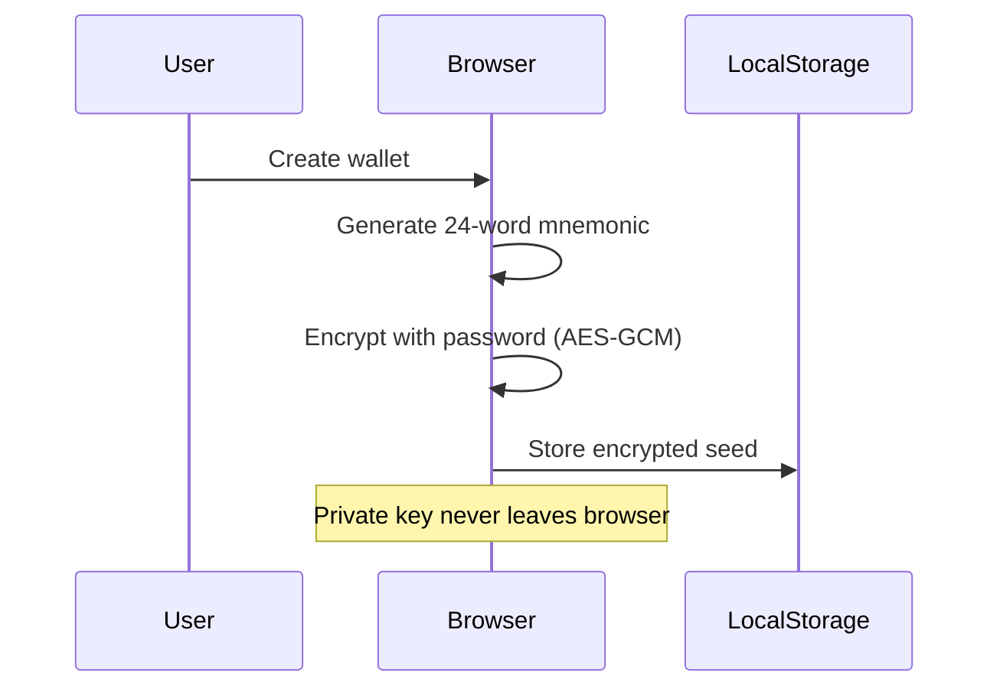
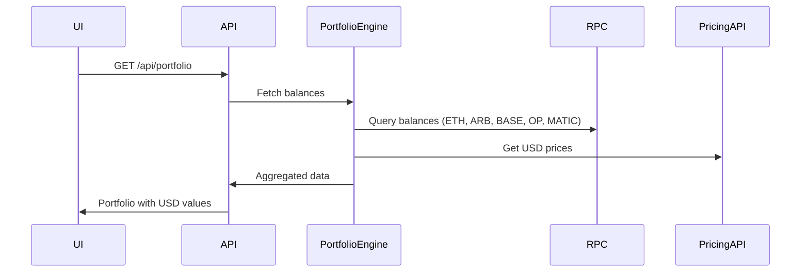
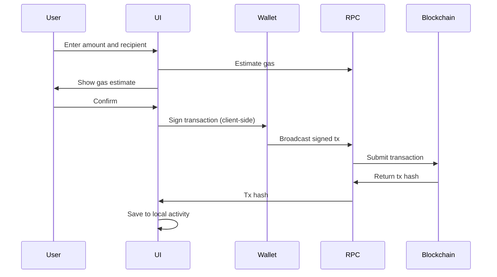
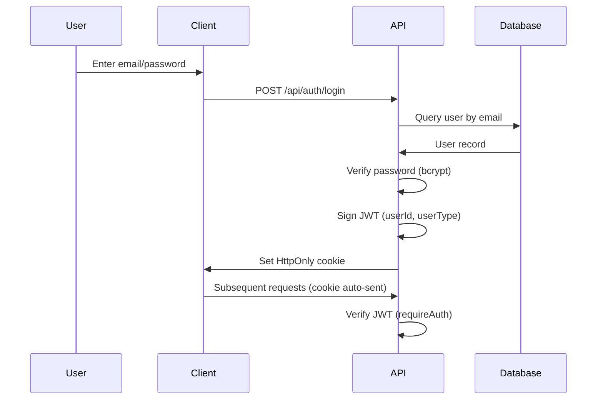
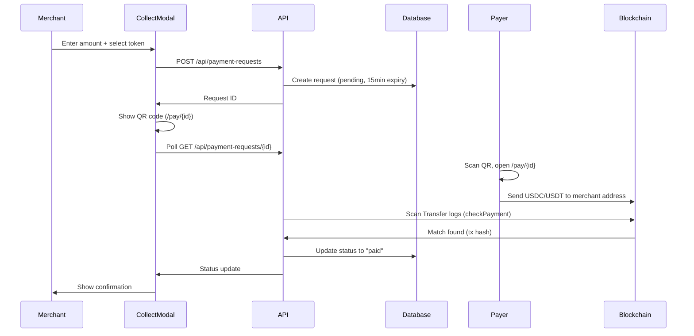

## Tech Stack

Walty is built on a modern, TypeScript-first web stack optimized for crypto wallet development:

| Layer | Technology |
|-------|------------|
| **Framework** | Next.js 16 (App Router) |
| **Language** | TypeScript |
| **UI** | React 19 + Tailwind CSS 4 |
| **Database** | PostgreSQL |
| **ORM** | Drizzle ORM |
| **Blockchain** | viem (Ethereum library) |
| **Authentication** | JWT (jsonwebtoken) |
| **Encryption** | Web Crypto API (AES-GCM + PBKDF2) |

### Key Dependencies

```json package.json
{
  "dependencies": {
    "next": "16.1.6",
    "react": "19.2.3",
    "drizzle-orm": "^0.45.1",
    "viem": "^2.46.3",
    "jsonwebtoken": "^9.0.3",
    "bcrypt": "^6.0.0",
    "pg": "^8.18.0"
  }
}
```

<Note>
Walty uses the **Next.js App Router** (not Pages Router). All routes are defined in the `app/` directory using the file-based routing convention.
</Note>

## Directory Structure

### Top-Level Organization

```
walty/
├── app/                    # Next.js pages and API routes
│   ├── api/               # Backend API endpoints
│   ├── dashboard/         # Authenticated wallet UI
│   ├── onboarding/        # Registration/login flow
│   └── pay/               # Public payment request pages
├── components/            # Reusable React components
│   ├── pos/              # Point-of-sale (merchant) UI
│   ├── settings/         # Settings dialog
│   ├── theme/            # Dark/light theme components
│   ├── locale/           # i18n language switcher
│   └── wallet/           # Send, swap, activity forms
├── lib/                   # Domain logic and utilities
│   ├── auth/             # Authentication helpers
│   ├── crypto.ts         # Encryption/decryption functions
│   ├── wallet.ts         # Wallet creation and signing
│   ├── transactions/     # Transaction building
│   ├── payments/         # Payment verification
│   ├── providers/        # RPC and pricing providers
│   ├── portfolio/        # Portfolio aggregation
│   └── chainAdapters/    # Multi-chain support
├── server/                # Server-only code
│   └── db/               # Drizzle client and schema
├── hooks/                 # React hooks
├── locales/              # i18n dictionaries (en, es)
├── drizzle/              # Database migrations
└── utils/                # Shared utilities
```

<Accordion title="What goes where?">
- **`app/`**: All routes (pages and API). Auth middleware is applied at the route level.
- **`components/`**: Pure UI components. Keep business logic in `lib/`.
- **`lib/`**: Domain logic, crypto operations, blockchain interactions. Most of the app logic lives here.
- **`server/`**: Server-only code that should never be bundled for the browser.
- **`hooks/`**: Client-side React hooks for wallet state, portfolio data, etc.
</Accordion>

### Key Directories in Detail

#### `app/` - Routes

| Path | Purpose |
|------|----------|
| `app/api/` | Backend API routes (auth, portfolio, transactions, etc.) |
| `app/dashboard/` | Authenticated pages (home, send, swap, activity, contacts) |
| `app/onboarding/` | Registration and wallet setup flow |
| `app/pay/[requestId]/` | Public payment request landing pages |

#### `lib/` - Core Logic

| Module | Purpose |
|--------|----------|
| `lib/wallet.ts` | Wallet creation, mnemonic handling |
| `lib/crypto.ts` | AES-GCM encryption for seed phrases |
| `lib/auth.ts` | JWT verification helper (`requireAuth`) |
| `lib/transactions/` | Transaction building and submission |
| `lib/payments/checkPayment.ts` | Blockchain log scanning for payment verification |
| `lib/providers/` | RPC provider routing (Alchemy, Ankr, public) |
| `lib/portfolio/` | Multi-chain balance aggregation |
| `lib/chainAdapters/` | Chain-specific logic (Ethereum, Polygon, etc.) |

#### `components/` - UI Components

| Component Group | Purpose |
|----------------|----------|
| `components/wallet/` | SendForm, SwapForm, ActivityList |
| `components/pos/` | CollectModal (merchant payment collection) |
| `components/settings/` | Settings dialog (theme, locale) |
| `components/theme/` | ThemeProvider, theme switcher |
| `components/locale/` | LocaleProvider, language switcher |

## Main Runtime Flows

### 1. Wallet Creation and Storage

**Client-side encryption flow:**



**Implementation:**

1. Mnemonic is generated client-side using `viem`
2. User provides a password
3. `lib/crypto.ts` encrypts the mnemonic with AES-GCM (PBKDF2-derived key)
4. Encrypted payload (ciphertext, IV, salt) is stored in `localStorage`
5. Wallet is locked after inactivity; decryption requires password re-entry

**Relevant modules:**
- `lib/wallet.ts` - Wallet creation
- `lib/crypto.ts` - `encryptSeed()`, `decryptSeed()`
- `lib/wallet-store.ts` - Browser storage interface

See [Security](/architecture/security) for encryption details.

### 2. Portfolio and Balances

**Multi-chain balance aggregation:**



**Implementation:**

1. Client requests portfolio via `GET /api/portfolio` (authenticated)
2. Backend loads user addresses from database
3. Portfolio engine queries balances across all supported chains (Ethereum, Arbitrum, Base, Optimism, Polygon)
4. Pricing providers (CoinGecko, DefiLlama) fetch current USD prices
5. Data is normalized and returned to client

**Relevant modules:**
- `app/api/portfolio/route.ts` - API endpoint
- `lib/portfolio/portfolio-engine.ts` - Balance aggregation
- `lib/providers/pricing/` - Price fetching
- `lib/chainAdapters/` - Chain-specific RPC calls

### 3. Send and Swap Transactions

**Transaction flow:**



**Implementation:**

1. User fills send/swap form in UI
2. App validates inputs and estimates gas
3. Transaction is simulated before signing (prevents reverts)
4. User confirms; transaction is **signed client-side** using decrypted private key
5. Signed transaction is broadcast to blockchain via RPC
6. Transaction hash is saved to database for activity tracking
7. Status updates are polled from blockchain

**Relevant modules:**
- `lib/transactions/` - Transaction building
- `components/wallet/SendForm.tsx` - Send UI
- `components/wallet/SwapForm.tsx` - Swap UI
- `app/api/tx/route.ts` - Transaction storage

<Warning>
All transaction signing happens **client-side**. The server never has access to private keys or mnemonics.
</Warning>

### 4. Authentication and Session Management

**JWT-based authentication:**



**Implementation:**

1. User registers or logs in via `POST /api/auth/register` or `/api/auth/login`
2. Server verifies credentials (bcrypt password hash)
3. Server signs a JWT containing `{ userId, email, userType }` using `JWT_SECRET`
4. JWT is set as an **HttpOnly, Secure, SameSite=Strict** cookie (7-day expiry)
5. Protected routes use `requireAuth()` to verify the JWT from cookies
6. User metadata (addresses, contacts, transaction history) is stored in PostgreSQL

**User types:**
- `"person"` (default) - Personal wallet users
- `"business"` - Merchant accounts with payment request (POS) features

**Relevant modules:**
- `lib/auth.ts` - `requireAuth()` helper
- `app/api/auth/login/route.ts` - Login endpoint
- `app/api/auth/register/route.ts` - Registration endpoint
- `server/db/schema.ts` - User schema

See [Database Schema](/architecture/database) for user table details.

### 5. Payment Requests (Point-of-Sale)

**Merchant payment collection flow:**



**Implementation:**

1. **Business accounts** can create payment requests (invoices)
2. Merchant opens `CollectModal`, enters amount, selects USDC or USDT on Polygon
3. `POST /api/payment-requests` creates a request with 15-minute expiry
4. QR code displays public link: `/pay/{requestId}`
5. Modal polls `GET /api/payment-requests/{requestId}` every 3 seconds
6. Payer scans QR, authenticates, and confirms payment on `/dashboard/pay/{requestId}`
7. Backend scans Polygon `Transfer` logs from `startBlock` to detect payment
8. When payment is detected and confirmed, status changes to `"paid"`
9. Merchant modal shows confirmation with transaction hash

**Relevant modules:**
- `lib/payments/checkPayment.ts` - Blockchain log scanning
- `components/pos/CollectModal.tsx` - Merchant UI
- `app/pay/[requestId]/page.tsx` - Public landing page
- `app/dashboard/pay/[requestId]/page.tsx` - Payer confirmation
- `app/api/payment-requests/route.ts` - Create request
- `app/api/payment-requests/[id]/route.ts` - Poll status

See [Database Schema](/architecture/database) for `payment_requests` table.

## Routing Structure

### Route Categories

<CodeGroup>
```text /dashboard/*
# Authenticated routes (redirect to /onboarding if not logged in)
/dashboard/home              # Portfolio overview
/dashboard/send              # Send tokens
/dashboard/swap              # Swap tokens
/dashboard/activity          # Transaction history
/dashboard/contacts          # Address book
/dashboard/pay/{requestId}   # Payment confirmation (payer)
```

```text /onboarding/*
# Unauthenticated registration and wallet setup flow
/onboarding/welcome          # Landing
/onboarding/login            # Login
/onboarding/register         # Sign up
/onboarding/create-wallet    # Generate mnemonic
/onboarding/recovery-phrase  # Display seed phrase
/onboarding/confirm-recovery # Verify seed phrase
/onboarding/create-pin       # Set PIN for backup
/onboarding/username         # Choose username
/onboarding/account-type     # Select person/business
/onboarding/complete         # Done
```

```text /pay/*
# Public payment request landing pages (no auth required)
/pay/{requestId}             # QR code destination
```

```text /api/*
# Backend API routes (most require authentication)
/api/auth/login              # POST: login
/api/auth/register           # POST: register
/api/portfolio               # GET: portfolio data (auth)
/api/tx                      # POST: save transaction (auth)
/api/payment-requests        # POST: create request (business, auth)
/api/payment-requests/{id}   # GET: poll status (public)
/api/wallet/challenge        # GET: server challenge for PIN backup (auth)
```
</CodeGroup>

<Note>
Authentication redirects are handled by `middleware.ts`. Dashboard routes require a valid JWT cookie.
</Note>

## Settings and Preferences

Walty supports runtime theme and locale switching:

| Setting | Options | Default | Storage |
|---------|---------|---------|----------|
| **Theme** | `dark`, `light` | `dark` | Cookie |
| **Locale** | `en`, `es` | `es` | Cookie |

**Implementation:**
- `utils/theme.ts` / `utils/locale.ts` - Read/write cookies (server + client)
- `components/theme/ThemeProvider` - React context for theme
- `components/locale/LocaleProvider` - React context for locale
- `components/settings/settings-dialog.tsx` - Settings modal (opened from sidebar)
- `locales/` - i18n dictionaries

## Next Steps

<CardGroup cols={2}>
  <Card title="Database Schema" icon="database" href="/architecture/database">
    Explore table schemas, relationships, and Drizzle ORM usage
  </Card>
  <Card title="Security Model" icon="shield" href="/architecture/security">
    Learn about encryption, key handling, and authentication
  </Card>
</CardGroup>
