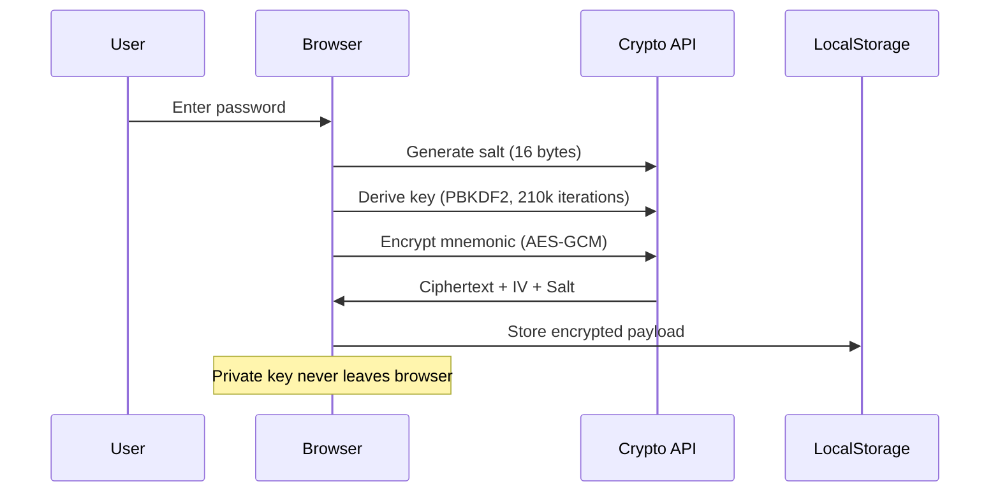
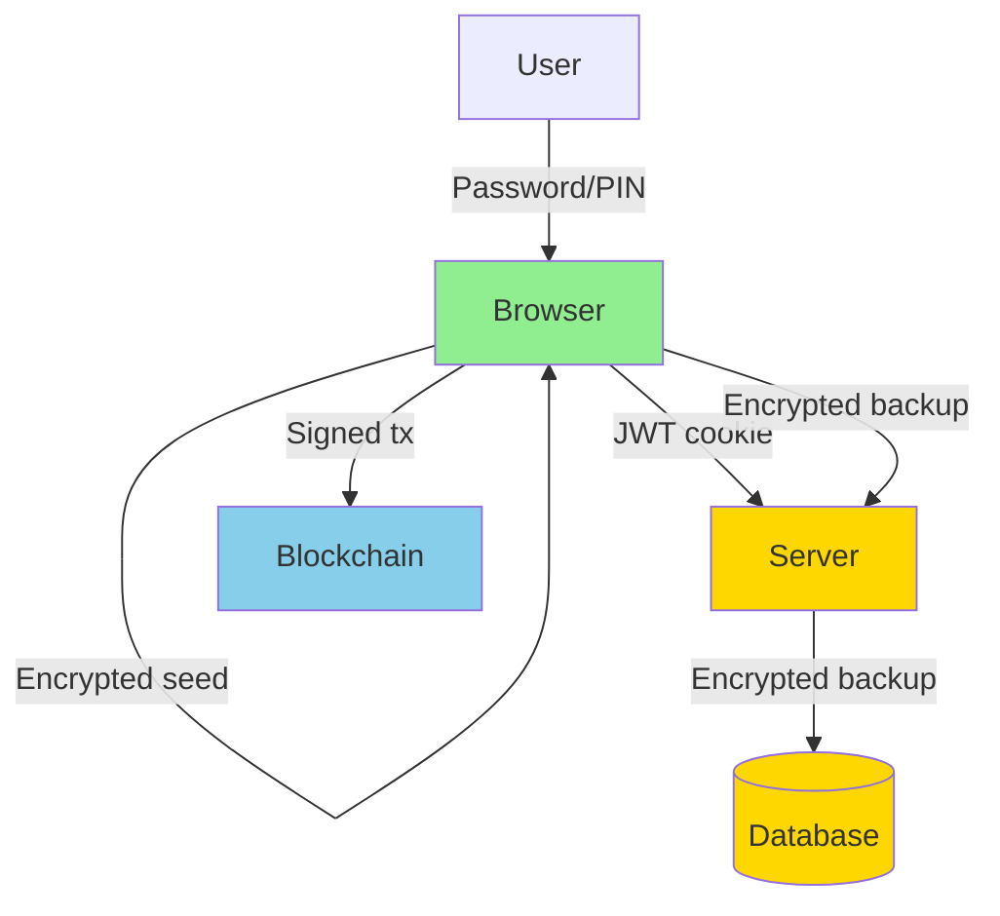

## Security Overview

Walty follows a **self-custody model** where users maintain full control of their private keys. The server never has access to unencrypted seed phrases or private keys.

### Key Principles

<CardGroup cols={2}>
  <Card title="Client-Side Encryption" icon="lock">
    All seed phrases are encrypted in the browser before storage
  </Card>
  <Card title="Zero Server Knowledge" icon="eye-slash">
    Server never sees unencrypted private keys or mnemonics
  </Card>
  <Card title="PIN-Based Backup" icon="shield-check">
    Optional server backup using PIN + server pepper
  </Card>
  <Card title="JWT Authentication" icon="key">
    HttpOnly cookies prevent XSS token theft
  </Card>
</CardGroup>

## Client-Side Encryption

### Seed Encryption Flow

When a user creates or imports a wallet, the mnemonic is encrypted client-side:



### Encryption Implementation

Walty uses the **Web Crypto API** for all cryptographic operations:

```typescript lib/crypto.ts
export type EncryptedSeed = {
  ciphertext: string  // Base64-encoded encrypted mnemonic
  iv: string          // Base64-encoded initialization vector (12 bytes)
  salt: string        // Base64-encoded PBKDF2 salt (16 bytes)
  version: 1          // Encryption version
}

export async function encryptSeed(
  mnemonic: string,
  password: string
): Promise<EncryptedSeed> {
  // Generate random salt and IV
  const salt = crypto.getRandomValues(new Uint8Array(16))
  const iv = crypto.getRandomValues(new Uint8Array(12))
  
  // Derive 256-bit AES key from password
  const key = await deriveKey(password, salt)
  
  // Encrypt mnemonic with AES-GCM
  const ciphertext = await crypto.subtle.encrypt(
    { name: "AES-GCM", iv },
    key,
    new TextEncoder().encode(mnemonic)
  )
  
  return {
    ciphertext: toBase64(new Uint8Array(ciphertext)),
    iv: toBase64(iv),
    salt: toBase64(salt),
    version: 1,
  }
}
```

### Key Derivation (PBKDF2)

Passwords are converted to encryption keys using PBKDF2:

```typescript lib/crypto.ts
async function deriveKey(password: string, salt: Uint8Array) {
  const baseKey = await crypto.subtle.importKey(
    "raw",
    new TextEncoder().encode(password),
    "PBKDF2",
    false,
    ["deriveKey"]
  )
  
  return crypto.subtle.deriveKey(
    {
      name: "PBKDF2",
      salt,
      iterations: 210000,  // OWASP recommended minimum
      hash: "SHA-256",
    },
    baseKey,
    { name: "AES-GCM", length: 256 },
    false,
    ["encrypt", "decrypt"]
  )
}
```

**Parameters:**
- **Algorithm:** PBKDF2 with SHA-256
- **Iterations:** 210,000 (OWASP 2023 recommendation)
- **Salt:** 16 bytes (cryptographically random)
- **Output:** 256-bit AES-GCM key

<Note>
PBKDF2 with 210,000 iterations provides strong protection against brute-force attacks while remaining fast enough for good UX.
</Note>

### Decryption Flow

```typescript lib/crypto.ts
export async function decryptSeed(
  encrypted: EncryptedSeed,
  password: string
): Promise<string> {
  const salt = fromBase64(encrypted.salt)
  const iv = fromBase64(encrypted.iv)
  const ciphertext = fromBase64(encrypted.ciphertext)
  
  const key = await deriveKey(password, salt)
  
  try {
    const plaintext = await crypto.subtle.decrypt(
      { name: "AES-GCM", iv },
      key,
      ciphertext
    )
    return new TextDecoder().decode(plaintext)
  } catch {
    throw new Error("Invalid password")
  }
}
```

<Warning>
AES-GCM provides **authenticated encryption**. If decryption fails, it means either the password is wrong or the ciphertext has been tampered with.
</Warning>

## PIN-Based Backup System

### Overview

Users can optionally back up their wallet to the server using a 6-digit PIN. This provides recovery if they lose access to their device.

**Security properties:**
- PIN alone is insufficient to decrypt the backup
- Server pepper (`SERVER_PEPPER`) is required for key derivation
- Offline brute-force attacks are computationally infeasible without the server pepper
- Server cannot decrypt backups without the user's PIN

### Server Challenge Generation

The server generates a user-specific challenge using HMAC:

```typescript app/api/wallet/challenge/route.ts
import crypto from "crypto"
import { requireAuth } from "@/lib/auth"

export async function GET(req: NextRequest) {
  const { userId } = requireAuth(req)
  
  const pepper = process.env.SERVER_PEPPER
  if (!pepper) {
    return NextResponse.json({ error: "Server misconfigured" }, { status: 500 })
  }
  
  // Generate deterministic challenge for this user
  const challenge = crypto
    .createHmac("sha256", pepper)
    .update(userId.toString())
    .digest("hex")
  
  return NextResponse.json({ challenge })
}
```

**Key properties:**
- Challenge is deterministic (same user always gets same challenge)
- Challenge is unpredictable without `SERVER_PEPPER`
- Challenge changes if server pepper is rotated

### PIN Encryption Implementation

```typescript lib/crypto.ts
export type PinEncryptedSeed = {
  ciphertext: string
  iv: string
  salt: string
  version: 2  // Version 2 = PIN-based encryption
}

export async function encryptSeedWithPin(
  mnemonic: string,
  pin: string,
  challenge: string,
): Promise<PinEncryptedSeed> {
  const salt = crypto.getRandomValues(new Uint8Array(16))
  const iv = crypto.getRandomValues(new Uint8Array(12))
  
  // Derive key from PIN + server challenge
  const key = await derivePinKey(pin, challenge, salt)
  
  const ciphertext = await crypto.subtle.encrypt(
    { name: "AES-GCM", iv },
    key,
    new TextEncoder().encode(mnemonic),
  )
  
  return {
    ciphertext: toBase64(new Uint8Array(ciphertext)),
    iv: toBase64(iv),
    salt: toBase64(salt),
    version: 2,
  }
}
```

### PIN Key Derivation

The encryption key is derived from `PIN + challenge`:

```typescript lib/crypto.ts
async function derivePinKey(
  pin: string,
  challenge: string,
  salt: Uint8Array
) {
  // Mix PIN with server challenge
  // Offline brute force requires the server pepper
  const material = pin + challenge
  
  const baseKey = await crypto.subtle.importKey(
    "raw",
    new TextEncoder().encode(material),
    "PBKDF2",
    false,
    ["deriveKey"],
  )
  
  return crypto.subtle.deriveKey(
    {
      name: "PBKDF2",
      salt,
      iterations: 210000,
      hash: "SHA-256",
    },
    baseKey,
    { name: "AES-GCM", length: 256 },
    false,
    ["encrypt", "decrypt"],
  )
}
```

**Security analysis:**

| Attack Vector | Protection |
|--------------|------------|
| **Offline brute-force** | Requires `SERVER_PEPPER` (unknown to attacker) |
| **Online brute-force** | Rate limiting on login endpoints |
| **Database breach** | Backups are encrypted; server cannot decrypt without PIN |
| **Weak PIN (e.g., 123456)** | Partially mitigated by server challenge; still vulnerable to online attacks |

<Warning>
**Important:** The PIN backup is only as strong as the user's PIN. Short or common PINs (e.g., "123456") are vulnerable to online brute-force attacks if rate limiting is bypassed.
</Warning>

### Backup Storage

Encrypted backups are stored in the `wallet_backups` table:

```typescript server/db/schema.ts
export const walletBackups = pgTable("wallet_backups", {
  id: serial("id").primaryKey(),
  userId: integer("user_id").notNull().references(() => users.id, { onDelete: "cascade" }),
  walletAddress: text("wallet_address").notNull(),
  ciphertext: text("ciphertext").notNull(),
  iv: text("iv").notNull(),
  salt: text("salt").notNull(),
  version: integer("version").notNull(),  // 2 = PIN-based
  createdAt: timestamp("created_at").defaultNow(),
  updatedAt: timestamp("updated_at").defaultNow(),
})
```

See [Database Schema](/architecture/database) for details.

## Authentication and Session Management

### JWT-Based Authentication

Walty uses **JSON Web Tokens (JWT)** for session management:

```typescript app/api/auth/login/route.ts
import jwt from "jsonwebtoken"
import bcrypt from "bcrypt"

export async function POST(req: NextRequest) {
  const { email, password } = await req.json()
  
  // Find user by email
  const user = await db.query.users.findFirst({
    where: eq(users.email, email),
  })
  
  if (!user) {
    return NextResponse.json({ error: "invalid credentials" }, { status: 401 })
  }
  
  // Verify password (bcrypt)
  const valid = await bcrypt.compare(password, user.passwordHash)
  if (!valid) {
    return NextResponse.json({ error: "invalid credentials" }, { status: 401 })
  }
  
  // Sign JWT
  const token = jwt.sign(
    { userId: user.id, email: user.email, userType: user.userType },
    process.env.JWT_SECRET!,
    { expiresIn: "7d" }
  )
  
  // Set HttpOnly cookie
  return new Response(JSON.stringify({ ok: true }), {
    headers: {
      "Content-Type": "application/json",
      "Set-Cookie": `token=${token}; HttpOnly; Secure; SameSite=Strict; Path=/`,
    },
  })
}
```

### JWT Payload

```typescript lib/auth.ts
export interface AuthPayload {
  userId: number
  email: string
  userType: "person" | "business"
}
```

### Cookie Security Flags

| Flag | Purpose |
|------|----------|
| **HttpOnly** | Prevents JavaScript access (XSS protection) |
| **Secure** | Only sent over HTTPS (MITM protection) |
| **SameSite=Strict** | Prevents CSRF attacks |
| **Path=/** | Available to all routes |

<Note>
HttpOnly cookies cannot be accessed by client-side JavaScript, even if an XSS vulnerability exists. This significantly reduces the impact of XSS attacks.
</Note>

### Protected Route Middleware

API routes verify JWT tokens using `requireAuth()`:

```typescript lib/auth.ts
import jwt from "jsonwebtoken"
import { NextRequest } from "next/server"

export interface AuthPayload {
  userId: number
  email: string
  userType: "person" | "business"
}

export function requireAuth(req: NextRequest): AuthPayload {
  const token = req.cookies.get("token")?.value
  if (!token) throw new Error("Unauthorized")
  return jwt.verify(token, process.env.JWT_SECRET!) as AuthPayload
}
```

**Usage in API routes:**

```typescript app/api/portfolio/route.ts
import { requireAuth } from "@/lib/auth"

export async function GET(req: NextRequest) {
  try {
    const { userId } = requireAuth(req)  // Throws if not authenticated
    
    // Fetch portfolio for authenticated user
    const portfolio = await getPortfolio(userId)
    return NextResponse.json(portfolio)
  } catch {
    return NextResponse.json({ error: "Unauthorized" }, { status: 401 })
  }
}
```

### Password Hashing (bcrypt)

User passwords are hashed using **bcrypt** before storage:

```typescript app/api/auth/register/route.ts
import bcrypt from "bcrypt"

export async function POST(req: NextRequest) {
  const { email, password } = await req.json()
  
  // Hash password with bcrypt (auto-salted)
  const passwordHash = await bcrypt.hash(password, 10)
  
  // Store user with hashed password
  await db.insert(users).values({
    email,
    passwordHash,
    userType: "person",
  })
  
  // ... generate JWT and return ...
}
```

**bcrypt properties:**
- **Work factor:** 10 rounds (configurable)
- **Auto-salted:** Each password gets a unique salt
- **Slow by design:** Resistant to brute-force attacks
- **Adaptive:** Can increase work factor as hardware improves

## Environment Variables

### Security-Critical Variables

<CodeGroup>
```bash .env
# Required: JWT signing secret
JWT_SECRET=your-secret-key-here-change-this-in-production

# Required: Server pepper for PIN backups
SERVER_PEPPER=your-pepper-key-here-change-this-in-production
```

```bash Generate secrets
# Generate JWT_SECRET
openssl rand -base64 32

# Generate SERVER_PEPPER
openssl rand -base64 32
```
</CodeGroup>

### Secret Rotation

<Warning>
**Rotating `JWT_SECRET`** will invalidate all existing sessions. Users will need to log in again.

**Rotating `SERVER_PEPPER`** will invalidate all PIN-based backups. Users will need to create new backups.
</Warning>

If you must rotate secrets:

1. **JWT_SECRET:** 
   - Update environment variable
   - Restart server
   - All users will be logged out

2. **SERVER_PEPPER:**
   - Update environment variable
   - Clear `wallet_backups` table (or keep old records for grace period)
   - Notify users to re-create backups

## Threat Model

### Assumptions

**What we protect against:**
- ✅ Database breach (encrypted backups)
- ✅ XSS attacks (HttpOnly cookies, CSP headers)
- ✅ CSRF attacks (SameSite cookies)
- ✅ Offline brute-force (server pepper, PBKDF2)
- ✅ Server compromise without database access

**What we do NOT protect against:**
- ❌ User device compromise (malware, keyloggers)
- ❌ Phishing attacks (user enters password on fake site)
- ❌ Weak user passwords/PINs
- ❌ Full server compromise (attacker controls server + database + can intercept user input)
- ❌ Client-side code injection (compromised CDN)

### Trust Boundaries



**Trust levels:**
- 🟢 **Browser (trusted):** User controls device; seed is encrypted
- 🟡 **Server (semi-trusted):** Can be compromised; never sees unencrypted seeds
- 🔵 **Blockchain (public):** Immutable; transactions are public

## Security Best Practices

### For Self-Hosters

<CardGroup cols={2}>
  <Card title="Use Strong Secrets" icon="key">
    Generate JWT_SECRET and SERVER_PEPPER with `openssl rand -base64 32`
  </Card>
  <Card title="Enable HTTPS" icon="lock">
    Always use TLS in production. HTTP transmits cookies in plaintext.
  </Card>
  <Card title="Database Encryption" icon="database">
    Use encrypted disks or database-level encryption at rest
  </Card>
  <Card title="Regular Backups" icon="floppy-disk">
    Back up PostgreSQL database regularly; test restoration
  </Card>
</CardGroup>

### For Users

<CardGroup cols={2}>
  <Card title="Strong Passwords" icon="shield">
    Use unique, long passwords for your wallet (minimum 12 characters)
  </Card>
  <Card title="PIN Security" icon="hashtag">
    Avoid common PINs like 123456. Use random 6-digit codes.
  </Card>
  <Card title="Verify URLs" icon="link">
    Always check the URL before entering your password (phishing protection)
  </Card>
  <Card title="Keep Seed Offline" icon="file-export">
    Write down your 24-word recovery phrase and store it securely offline
  </Card>
</CardGroup>

## Next Steps

<CardGroup cols={2}>
  <Card title="Database Schema" icon="database" href="/architecture/database">
    Explore table schemas and relationships
  </Card>
  <Card title="Architecture Overview" icon="sitemap" href="/architecture/overview">
    Back to architecture overview
  </Card>
</CardGroup>
