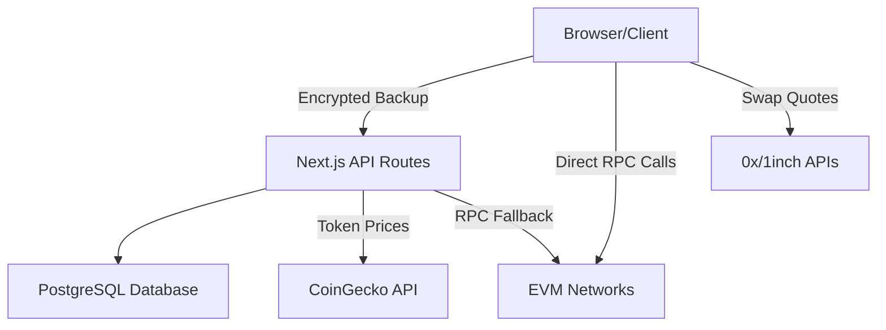

## What is Walty?

Walty is a free and open-source self-custodial wallet for EVM networks that helps you manage crypto assets across Ethereum-compatible networks from a single interface. You can create or recover wallets, track balances and portfolio value, send native/ERC-20 tokens, and execute swaps with quote aggregation.

The wallet follows a self-custody model: seed material is encrypted locally in the browser and transaction signing happens client-side. This means you maintain complete control over your private keys and funds at all times.

## Key Features

<CardGroup cols={2}>
  <Card title="Self-Custody" icon="shield-check">
    Your seed phrase is encrypted locally in the browser. Private keys never leave your device, and transaction signing happens client-side.
  </Card>
  
  <Card title="Multi-Chain Support" icon="network-wired">
    Support for Ethereum, Arbitrum, Base, Optimism, and Polygon with cross-chain portfolio view and token balances.
  </Card>
  
  <Card title="Token Management" icon="coins">
    Send native tokens and ERC-20s with real-time gas estimation, transaction history, and on-chain status updates.
  </Card>
  
  <Card title="Token Swaps" icon="arrow-right-arrow-left">
    Execute token swaps with live quotes, automatic ERC-20 approval handling, and transaction simulation before execution.
  </Card>
</CardGroup>

## Core Capabilities

### Wallet Management

- **Create and Import**: Generate new wallets with 24-word seed phrases or import existing ones
- **Local Encryption**: Automatic wallet lock with AES encryption of seed material
- **Backup & Recovery**: Export and import encrypted wallet backups
- **Address Book**: Save and manage contacts for easy transfers

### Multi-Chain EVM Support

- Support for **Ethereum**, **Arbitrum**, **Base**, **Optimism**, and **Polygon**
- Cross-chain portfolio view with token balances and USD values
- Full ERC-20 token support across all supported networks
- ENS name resolution for Ethereum addresses

### Transactions

- Send native tokens (ETH, MATIC, etc.) and ERC-20 tokens
- Real-time gas estimation before transaction submission
- Complete transaction history with on-chain status updates
- Direct explorer links for tracking transactions on-chain

### Token Swaps

- Token swaps with live quotes from multiple aggregators
- Automatic ERC-20 approval handling
- Transaction simulation before execution to prevent failed swaps
- Support for 0x and 1inch swap protocols

### Privacy & Control

- **Self-Host**: Deploy on your own infrastructure
- **No Tracking**: No analytics or tracking by default
- **Client-Side Security**: All key handling and signing happens in your browser
- **Open Source**: Full transparency with MIT license

### Additional Features

- Multi-language support (English and Spanish)
- Dark mode for comfortable viewing
- Responsive design for desktop and mobile
- ENS name resolution for user-friendly addresses

## Use Cases

### Personal Crypto Management

Manage your crypto assets across multiple EVM chains from a single interface. Track your portfolio value, execute transfers, and swap tokens without relying on third-party custodial services.

### Self-Hosted Infrastructure

Deploy Walty on your own servers to maintain complete control over your wallet infrastructure. Perfect for privacy-conscious users who want to avoid relying on hosted wallet services.

### Development and Testing

Use Walty as a development wallet for testing dApps and smart contracts across multiple EVM networks. The self-hosted nature makes it ideal for development environments.

### Privacy-Focused Operations

For users who prioritize privacy, Walty's self-hosted deployment option means no data is shared with third parties. All operations happen on your infrastructure.

## Technology Stack

Walty is built with modern web technologies:

- **Next.js 16** - React framework for the frontend and API routes
- **PostgreSQL** - Database for storing encrypted wallet backups and transaction history
- **Drizzle ORM** - Type-safe database operations
- **Viem** - Ethereum library for wallet operations and contract interactions
- **Tailwind CSS** - Utility-first styling framework

## Architecture

<Note>
  Private keys are **never** sent to the server. The database only stores encrypted wallet backups that can only be decrypted with your PIN.
</Note>

## Getting Started

Ready to get started with Walty? Check out our guides:

<CardGroup cols={2}>
  <Card title="Quickstart" icon="rocket" href="/quickstart">
    Get Walty running in minutes with Docker
  </Card>
  
  <Card title="Installation" icon="download" href="/installation">
    Detailed installation and deployment instructions
  </Card>
</CardGroup>

## Open Source

Walty is open source and available under the MIT license. Contributions are welcome!

- **Repository**: [github.com/ignaciogarcia-dev/walty](https://github.com/ignaciogarcia-dev/walty)
- **License**: MIT
- **Community**: Issue-first contribution model

<Warning>
  Walty is self-custodial software. You are solely responsible for securing your seed phrase and PIN. Lost credentials cannot be recovered.
</Warning>